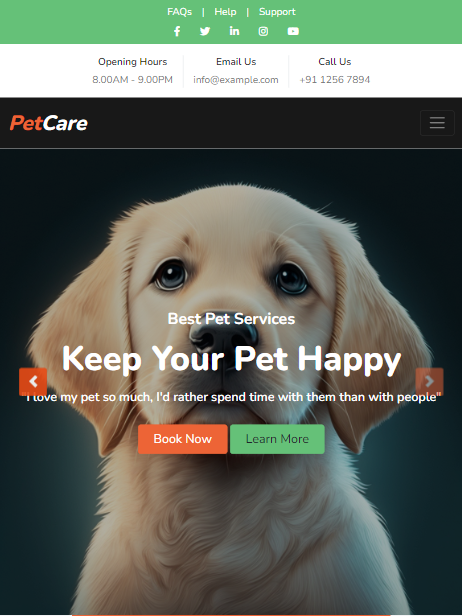

# Personal Portfolio Website

A modern, responsive portfolio website built with React.js showcasing my skills, projects, and professional experience.

1. Clone the repo

2. Install dependencies

3. Start the development server

4. Open [http://localhost:5173](http://localhost:5173) in your browser

## 🔧 Configuration

1. Update personal information:
   - Edit `src/components/About.jsx` with your details
   - Replace CV in `public/assets/`
   - Update profile image in `public/assets/`

2. Configure contact form:
   - Update SheetDB URL in `src/components/Contact.jsx`

3. Modify projects:
   - Edit project details in `src/components/Projects.jsx`
   - Add project images to `public/assets/`

## 📱 Responsive Design

- Desktop (1280px and above)
- Tablet (768px to 1279px)
- Mobile (600px and below)

## 🤝 Contributing

Contributions, issues, and feature requests are welcome!

1. Fork the repository
2. Create your feature branch (`git checkout -b feature/AmazingFeature`)
3. Commit changes (`git commit -m 'Add some AmazingFeature'`)
4. Push to branch (`git push origin feature/AmazingFeature`)
5. Open a Pull Request

## 📝 License

This project is [MIT](LICENSE) licensed.

## 📧 Contact

Akshat Choksi - [akshatchoksi2003@gmail.com](mailto:akshatchoksi2003@gmail.com)

Project Link: [https://github.com/Akshat190/portfolio-website](https://github.com/Akshat190/portfolio-website)
